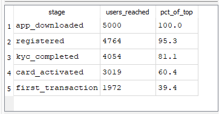
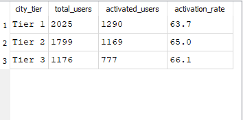
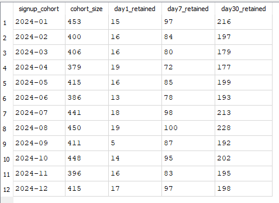
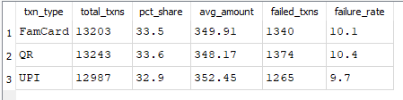
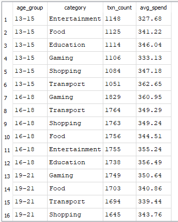
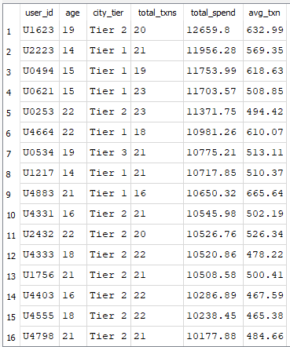

# 💳 FamPay User Behavior & Payment Funnel Analysis

A product analytics project simulating data analysis for a youth-focused 
UPI payments platform (inspired by FamPay/Fam).

## 🔗 Live Dashboard
👉 [Click here to view live dashboard](https://fampay-analytics.streamlit.app)

---

## 📌 Project Overview
This project analyzes user behavior, payment patterns, and retention 
for a youth UPI payments app serving users aged 13-25 across India.

**Key Questions Answered:**
- Where do users drop off in the onboarding funnel?
- Which city tiers have the highest activation rates?
- How does retention look across monthly cohorts (D1/D7/D30)?
- Which payment methods are most used?
- What do different age groups spend on?

---

## 📊 Key Findings

| Finding | Insight |
|---|---|
| 🔴 Biggest funnel drop | Card Activation → First Transaction (34.6% drop) |
| 🏙️ Best activation | Tier 3 cities (66.1%) outperform Tier 1 (63.7%) |
| 👥 D30 retention | ~47-50% across all cohorts |
| 💸 Payment split | UPI, FamCard, QR equally used (~33% each) |
| 🎯 Top category 13-15 | Entertainment & Food |

---

## 📁 Project Structure
```
fampay-analysis/
├── generate_data.py      # Generates simulated dataset
├── database.py           # Loads data into SQLite
├── queries.sql           # SQL analysis queries
├── app.py                # Streamlit dashboard
├── users.csv             # 5,000 simulated users
├── transactions.csv      # 39,000+ transactions
├── funnel_events.csv     # 18,000+ funnel events
└── README.md
```

---

## 📈 Analyses Performed

### 1. Onboarding Funnel
Tracks users from app download → first transaction.
Identifies KYC and Card Activation as biggest drop-off stages.



### 2. City Tier Activation
Compares card activation rates across Tier 1, 2, 3 cities.



### 3. Cohort Retention (D1/D7/D30)
Measures how many users return after 1, 7, and 30 days.



### 4. Payment Method Analysis
Breaks down UPI vs FamCard vs QR usage and failure rates.



### 5. Age Group Spending
Shows which categories different age groups (13-25) spend on.



### 6. High Value Users
Identifies top spending users for targeting and retention.



---

## 🧪 A/B Test Design

**Problem:** 25% drop-off at KYC → Card Activation stage

**Hypothesis:** Progress bar + ₹50 cashback will improve KYC 
completion by 10%+

| | Control | Treatment |
|---|---|---|
| Experience | Current KYC | KYC + progress bar + ₹50 cashback |
| Users | 1,000 | 1,000 |
| Duration | 14 days | 14 days |
| Metric | KYC completion rate | KYC completion rate |
| Significance | p < 0.05 | p < 0.05 |

---

## 🛠️ Tech Stack

| Tool | Usage |
|---|---|
| Python | Core language |
| Pandas | Data manipulation |
| SQL (SQLite) | Data querying & analysis |
| Matplotlib | Charts & visualizations |
| Seaborn | Heatmaps |
| Streamlit | Live dashboard |

---

## ▶️ Run Locally
```bash
git clone https://github.com/sunidhi009/Fampay-Analysis.git
cd Fampay-Analysis
pip install -r requirements.txt
streamlit run app.py
```

---

## 👤 Author
**Sunidhi Choudhary**  
[LinkedIn](https://linkedin.com/in/sunidhi05) | 
[GitHub](https://github.com/sunidhi009)
